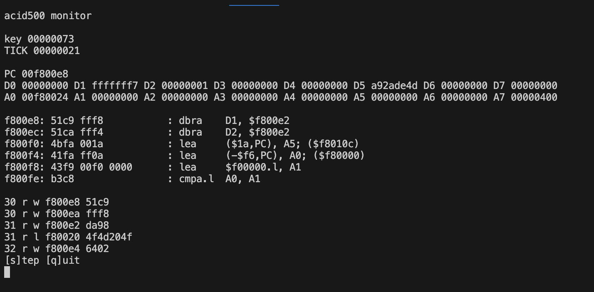

A project to celebrate 30th anniversary of original Skidmarks game.

The thing about blitz basic games is they don't (typically) hit the hardware directly so headless emulation with native skin (connected via breakpoint) seems plausible.

History 101
===========

In the beginning there was the command line (after the punch card after the mechanical switch grid).

Then came the mouse, and then came the workbench, and then there was confusion for app startup.

    movea.l ($114,A6), A3
    move.l  ($ac,A3), D1
    beq     iscommandline

[test notes](notes.txt)

[Invite to #skid30 channel on Discord](https://discord.gg/QRx5tDjqx)

