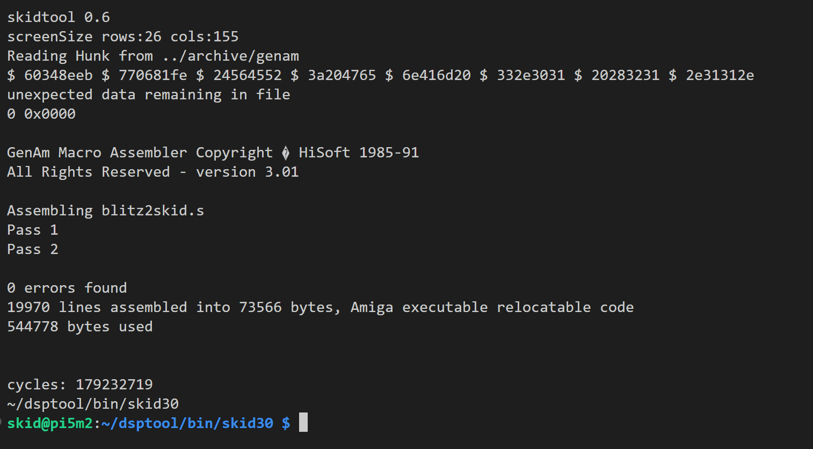

ACID500

Copyright (c) 2024 Simon Armstong (@nitrologic)

All rights reserved.

The ACID500 is designed to boot and execute a selection of classic amiga binaries without the need of a proprietary Kickstart ROM. Exec and dos.library are both implemented on native side of the emulation architecture.

Latest milestone - ACID500 sucessfully hosts Hisoft genam assembling a fresh build of Sibly's finest source - Blitz2 - basic compiler of champions.

Active progress on this project includes the use of the lha command line archiving tool as most useful utility to have running.

Current research is AmigaDOS lock behavior as possibly cause of lha tool write failures. [recent log file](MyACID500/log/lhaskid4.log)

[skidtool](skidtool)
