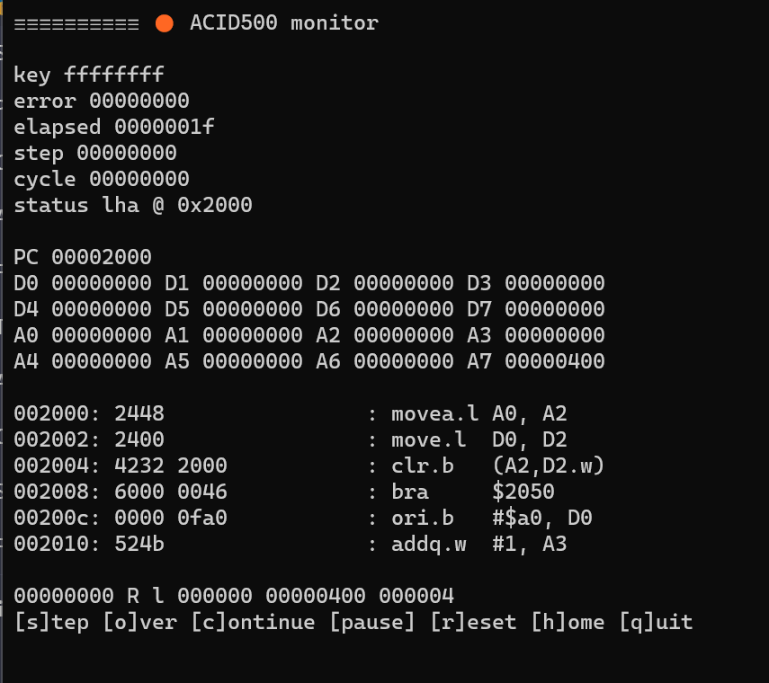
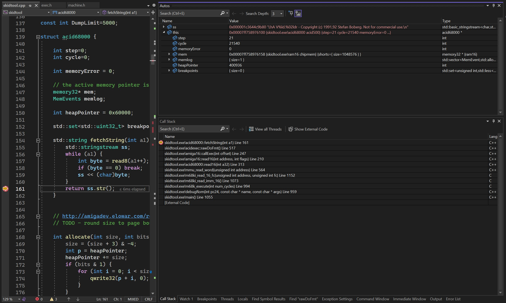

A project to celebrate 30th anniversary of original Skidmarks game.

The original musashi 68000 emulator has a new home in the ACID500 console.

Active progress on this project includes the use of the lha command line archiving tool as most useful utility to have running.

The ACID500 is designed to boot and execute a selection of classic amiga binaries without the need of a proprietary Kickstart ROM. Exec and dos.library are both implemented on native side of the emulation architecture.

[test notes](notes/notes.txt)
